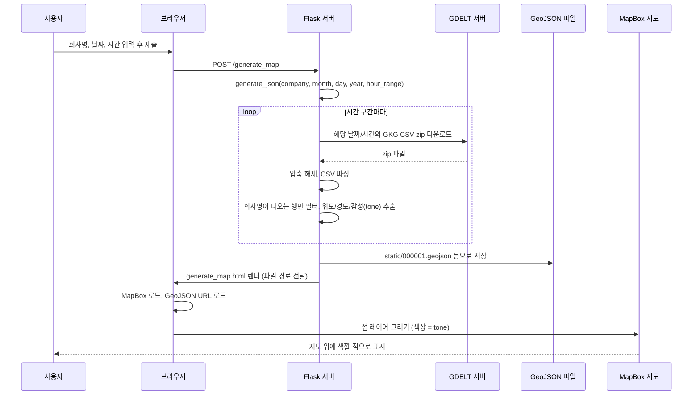

# NewsMap 프로젝트 분석 (초보 개발자용)

[NewsMap](https://github.com/jvallyea/NewsMap)은 2017년 HackMIT에서 만든 **"뉴스를 지도 위에 보여주는"** 웹 앱입니다. 특정 키워드(회사명 등)가 나오는 뉴스가 **어느 지역**에서 많이 언급되는지, 그리고 그 뉴스의 **감성(tone)**이 어떤지 지도 위 점으로 표시합니다.

---

## 1. 한 줄로 요약

**사용자가 회사 이름과 날짜/시간을 입력하면 → GDELT에서 그 회사 관련 뉴스 데이터를 받아와 → 위도/경도와 감성 점수를 추출하고 → GeoJSON으로 저장한 뒤 → MapBox 지도 위에 색깔 있는 점으로 보여준다.**

---

## 2. 프로젝트 폴더 구조 (역할만 이해하면 됨)

```
NewsMap/NewsMap-master/
├── app.py, index.py      ← 웹 서버 + 사용자 입력 받고 지도 생성 요청 처리
├── gdelt_dynamic.py      ← GDELT 데이터 다운로드 & 파싱 (스크립트 버전)
├── nasdaq_ex.py          ← 주가 데이터 가져오기 (WebSocket, 별도 실행)
├── process_input.py      ← 폼 입력값 읽기 (CGI용, 실제로는 Flask에서 request로 처리)
├── requirements.txt      ← 필요한 Python 패키지 목록
├── runtime.txt           ← Heroku 배포용 Python 버전
├── geographic_data.csv   ← 지역 데이터 (좌표 등)
├── features-1.geojson    ← 지도에 그릴 데이터 예시
├── static/               ← 지도에 쓸 GeoJSON 파일들 (000001.geojson, goldman.geojson 등)
├── templates/            ← HTML 페이지 (layout.html, generate_map.html 등)
└── Datasets/             ← GDELT에서 받은 CSV 압축 파일 풀어 둔 곳 (실행 시 생성)
```

- **백엔드**: Python + **Flask** (웹 서버이자 "입력 받고 → 데이터 만들고 → 어떤 HTML 줄지 정하는" 역할)
- **프론트(지도)**: HTML + **MapBox GL JS** (지도 라이브러리)
- **데이터 소스**: **GDELT** (뉴스 이벤트/위치/감성 데이터), NASDAQ(주가)는 별도 스크립트

---

## 3. 데이터가 흐르는 순서 (처음부터 끝까지)



- 사용자 입력 → Flask가 GDELT에서 데이터 받아서 가공 → GeoJSON 파일로 저장 → HTML에 "이 GeoJSON 불러와"라고 넣어서 → 브라우저에서 MapBox가 지도에 그려줍니다.

---

## 4. 핵심 개념 (초보자용 설명)

### 4-1. Flask

- **역할**: "웹 서버" + "URL별로 무엇을 할지 정해 주는 것".
- `@app.route("/")` → "주소가 `/`이면 `layout.html` 보여줘."
- `@app.route("/generate_map", methods=['POST'])` → "폼에서 제출하면 회사/날짜/시간 받아서 `generate_json()` 실행하고, 만들어진 GeoJSON 경로를 넣은 `generate_map.html` 보여줘."

### 4-2. GDELT (Global Data on Events, Language, and Tone)

- **역할**: 전 세계 뉴스를 정리한 공개 데이터. "누가, 언제, 어디서, 어떤 톤으로" 나오는지 CSV로 제공.
- NewsMap은 그중 **GKG(Global Knowledge Graph)** CSV를 사용.
  - URL 예: `http://data.gdeltproject.org/gdeltv2/20170915030000.gkg.csv.zip`
  - `2017` `09` `15` `03` `00` `00` → 2017년 9월 15일 03시 00분 00초 구간.
- 압축을 풀면 CSV 한 파일. 각 행은 탭(`\t`)으로 구분되고, 특정 열에:
  - **위치**: 컬럼 9, 10 등에 `#`로 구분된 값들 (그 안에 위도#경도 형태).
  - **언급 주체/대상**: 컬럼 13, 14에 회사/사람 이름 등.
  - **감성(tone)**: 컬럼 15에 숫자 (예: -8 ~ 8, 음수면 부정, 양수면 긍정).
- `app.py`의 `generate_json()`은 "회사명이 13번/14번 열에 있는 행만 골라서" 위도·경도·tone을 리스트에 모은 뒤 GeoJSON으로 만듭니다.

### 4-3. GeoJSON

- **역할**: "지도 위에 그릴 점/선/면"을 JSON 형식으로 표현한 것.
- 구조는 대략:
  - `type`: `"FeatureCollection"`
  - `features`: 배열. 각 항목이 하나의 점.
    - `geometry`: `type: "Point"`, `coordinates: [경도, 위도]`
    - `properties`: 예) `tone: -3`
- MapBox는 이 JSON(또는 JSON 파일 URL)을 넘기면 자동으로 지도 위에 점을 그려 주고, `properties.tone` 같은 값을 이용해 **색상**을 매길 수 있습니다.

### 4-4. MapBox

- **역할**: 브라우저에서 지도를 그려 주는 라이브러리(MapBox GL JS).
- `generate_map.html`에서:
  - `mapboxgl.Map()`으로 지도 생성.
  - `map.addLayer()`로 **GeoJSON 소스**를 넣고, 레이어 타입을 `circle`로 해서 "점"으로 표시.
  - `circle-color`를 `property: 'tone'`에 따라 -8(빨강) ~ 8(초록) 그라데이션으로 지정.

즉, **뉴스 데이터 → GeoJSON(위치 + tone) → MapBox가 지도 위에 색깔 점으로 시각화**하는 구조입니다.

---

## 5. 주요 파일이 하는 일 (요약)

| 파일 | 하는 일 (쉽게) |
| ------------------------------- | -------------------------------------------------------------------------------------------------------------------------------- |
| **app.py** / **index.py** | Flask 앱. `/`는 메인 화면, `/generate_map`은 폼 제출 시 GDELT 조회 후 GeoJSON 만들고 지도 페이지로 이동. `/static_goldman` 등은 미리 만든 GeoJSON 쓰는 정적 지도 페이지. |
| **generate_json()** (app.py 안) | 사용자 입력(회사, 날짜, 시간 구간)으로 GDELT CSV를 여러 개 받아 파싱 → 위도·경도·tone 배열 채움 → GeoJSON 파일로 저장. |
| **gdelt_dynamic.py** | `app.py`와 같은 로직을 "스크립트"로만 둔 것. 회사/날짜를 코드에 넣고 실행하면 `test.geojson` 생성. (Python 2 스타일) |
| **nasdaq_ex.py** | 주가용. WebSocket으로 특정 서버에 날짜·종목 보내서 데이터 받는 별도 스크립트. 지도와는 독립. |
| **templates/layout.html** | 메인 화면. "회사명, 날짜, 시간 입력" 폼 + 미리 만든 지도 링크(Nasdaq, Disney 등). |
| **templates/generate_map.html** | 지도 페이지. MapBox로 GeoJSON(`filename`) 불러와서 tone에 따라 색깔 점으로 표시. |
| **static/*.geojson** | 이미 만들어 둔 지도 데이터. 회사별·검색별로 생성된 파일. |

---

## 6. 초보자가 보면 좋은 포인트

- **입력 → 서버에서 데이터 가공 → 파일/JSON으로 저장 → 프론트에서 시각화** 라는 전형적인 웹 앱 흐름을 그대로 따릅니다.
- **GDELT**: "뉴스 + 위치 + 감성"을 한 번에 쓰고 싶을 때 검색해 보면 좋습니다. (최신 API/형식은 GDELT 공식 문서 참고.)
- **GeoJSON**: 지도 라이브러리(MapBox, Leaflet 등)가 공통으로 지원하므로, "지도에 뭔가 그리기"를 배울 때 유용한 형식입니다.
- 2017년 코드라 **Python 2 문법**(`print` without parentheses, `urllib` 등)이 섞여 있고, 예외 처리도 `except: pass`처럼 단순합니다. 지금은 Python 3 + 가독성 좋은 예외 처리로 바꾸는 것을 추천합니다.

---

## 7. Bubble-Map과 비교 (참고)

- **뉴스를 지도에 표시**한다는 아이디어는 동일.
- **NewsMap**: 2D 지도(MapBox), 데이터는 GDELT, "회사명 + 날짜" 검색, 감성은 색상.
- **Bubble-Map**: 3D 지구(Three.js), 데이터는 News API(국가별 헤드라인), 버블 크기=중요도·색=카테고리, 타임라인 슬라이더.

이 분석을 바탕으로 "GDELT를 써보고 싶다", "GeoJSON 구조를 우리 프로젝트에 적용하고 싶다" 등 구체적인 다음 단계를 정하면 됩니다.
